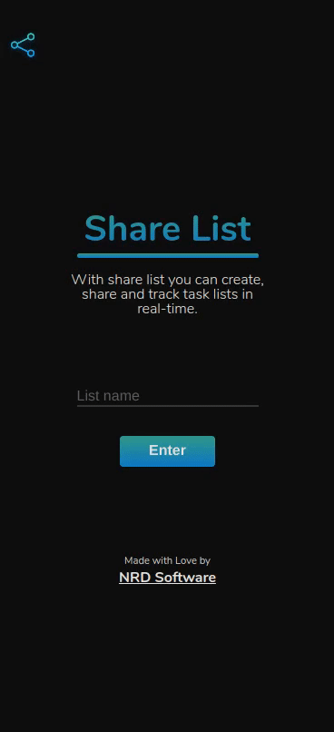

# Share List

ShareList is a real-time tasks list to share with anyone using React and Google's Real-Time Database. Built for NRD Software.

  

## [Try it out here](https://tasklist-19334.web.app/ "Homepage")

### Installation

Clone the repository, run `yarn && yarn start` on the root directory, and it will be available for you on localhost:5000.

Do not forget to use your google credentials on the .env file to connect to your database.

### What I learned/Used on this project

- React
- Google's Real-Time database
- CSS
